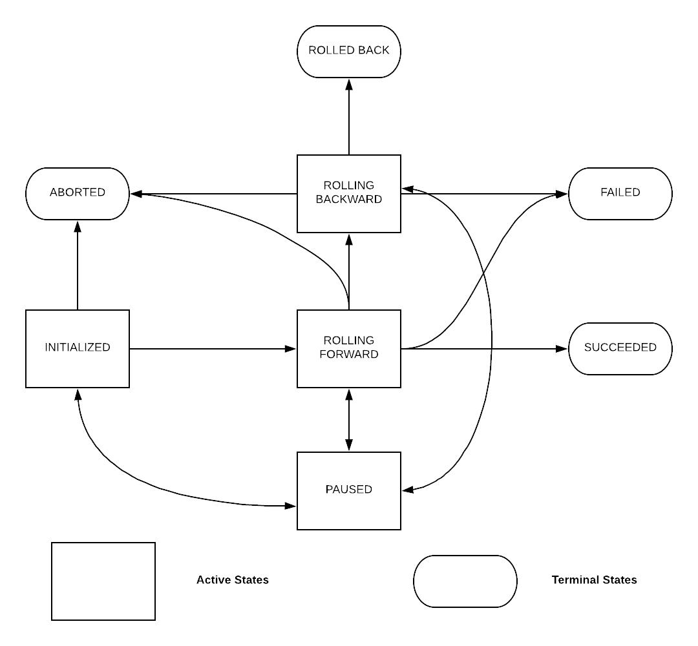

Stateless Job Update Lifecycle
------------------------------
When Peloton receives a request to update a stateless job, it will persist the request
into storage and mark update as **INITIALIZED**. Then the state would change according
to runtime state and update configuration.

ROLLING FORWARD To SUCCEEDED
----------------------------
As soon as an update is processed by Peloton, it would transit to **ROLLING FORWARD**
state. It means tasks in the job are being updated, respecting update spec and job SLA.
As soon as all the tasks needed to be updated in the job have been processed, update
would transit into **SUCCEEDED** state.

ROLLING BACKWARD, ROLLED BACK And FAILED
----------------------------------------
Peloton decides whether an update is successful given the UpdateSpec provided.

If **RollbackOnFailure** is set in UpdateSpec, update
would enter **ROLLING BACKWARD** state. Peloton would try to rollback the job to
the previous configuration. If rolling back fails, update would enter **FAILED**
state. If rollback back succeeds, update would terminated with **ROLLED BACK** state.

If **RollbackOnFailure** is set in UpdateSpec, update would enter **FAILED** state
directly.

ABORTED and PAUSED
------------------
Any non-terminal state can transit to **ABORTED**/**PAUSED** state upon user's
request. The major difference is that update can still resume with original state
after it enters **PAUSED** state, but once update enters **ABORTED** state it would
end up with the state.

Another difference is that, update would be in **PAUSED** state only when user
explicitly pauses an update. But, update can be in **ABORTED** state not only
when user aborts an update but also when it is overwritten by a new update.
